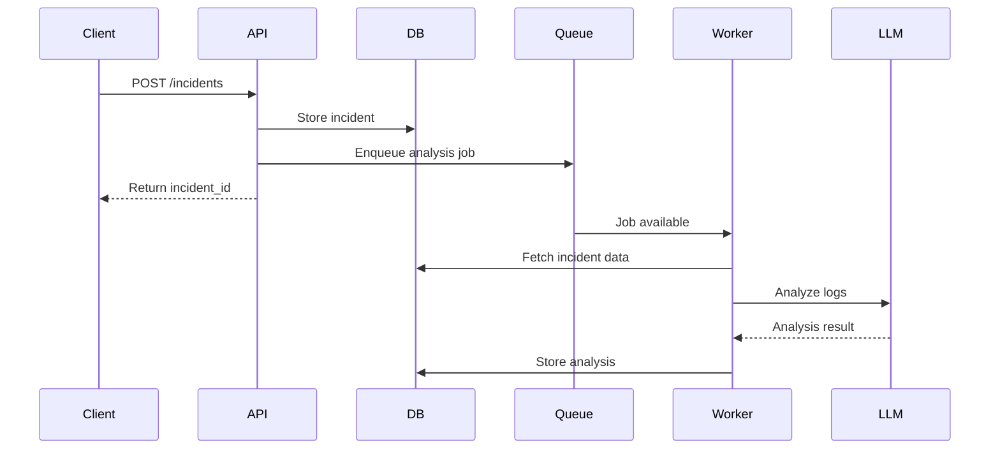

## Architecture

IncidentLens follows a simple event-driven architecture designed to simulate how production incident analysis systems might operate in real-world environments.

The system separates responsibilities between an API layer, a background processing pipeline, and an analysis component.

When a new incident is reported, the API stores the incident data and schedules an asynchronous analysis job. A background worker then processes the incident, analyzes logs and alerts, and generates a structured report that can later be retrieved through the API.

This design allows incident ingestion to remain fast while heavier analysis tasks run asynchronously in the background.

### Components

**API Layer (FastAPI)**  
Handles incident ingestion and exposes endpoints for retrieving incident status and analysis results.

**Database (PostgreSQL)**  
Stores incident metadata, logs, and analysis results.

**Queue (Redis)**  
Decouples incident ingestion from analysis by enabling asynchronous processing.

**Worker Service**  
Processes analysis jobs by fetching incident data, analyzing logs, and generating summaries.

**LLM Analysis Engine**  
Uses language models to summarize logs, detect potential root causes, and generate recommendations.

### Incident Processing Sequence

